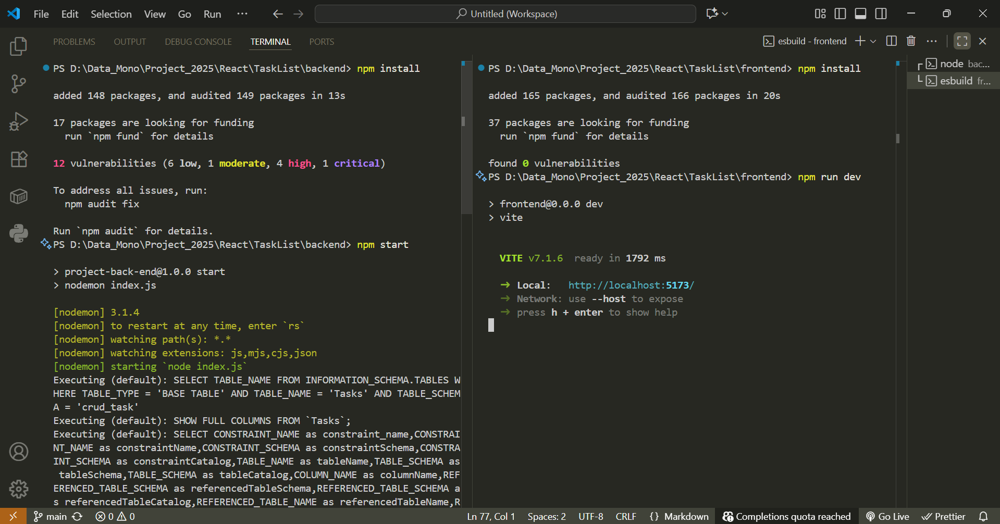

# Cara Instalasi Project

## ⚡ Prasyarat

Pastikan sudah terinstal:

- Node.js (versi 18+ disarankan)
- npm atau yarn
- MySQL (via XAMPP / Laragon)
- Visual Studio Code (opsional)

---

## 🔧 Instalasi Backend

1. Buka terminal, masuk ke folder backend:

````bash
cd backend

2. Install dependencies:

```bash
npm install
```

4. Jalankan Database MySQL dan buat database:

```bash
CREATE DATABASE crud_task;
```

3. Jalankan server:

```bash
node index.js
```

4. Backend berjalan di:

```bash
http://localhost:5000
```

## 🔧 Instalasi Frontend

1. Buka terminal baru masuk ke folder frontend:


```bash
cd frontend
```

2. Install dependencies:

```bash
npm install
```

3. Jalankan frontend::

```bash
npm run dev
```

4. Frontend berjalan di:

```bash
http://localhost:5173
```
````
